# Указываем ключ для Mistral
И устанавливаем библиотеку, если её нет


```python
#!pip install mistralai
MISTRAL_API_KEY = "ВСТАВИТЬ КЛЮЧ"
```

# Подключение библиотек


```python
from docx import Document
from mistralai import Mistral

from PIL import Image, ImageFont, ImageDraw, ImageFilter, ImageEnhance, ImageDraw
import numpy as np
import matplotlib.pyplot as plt
from io import BytesIO

import os
import re
import json
from urllib import request
import time
import requests
import random
```

# Поиск файлов с главами


```python
pattern = re.compile('scenes_chapter_[0-9]+.docx')

scenes_chapters = [ _ for _ in os.listdir('.') if pattern.match(_) ]

scenes_chapters.sort(key=lambda x : int(x.split("_")[2].split(".")[0]))

print(scenes_chapters)
```

    ['scenes_chapter_1.docx', 'scenes_chapter_2.docx', 'scenes_chapter_3.docx', 'scenes_chapter_4.docx', 'scenes_chapter_5.docx']


# Функции для чтения и сохранения файлов формата doc


```python
from docx import Document

def read_doc(file_path):
    """
    Чтение DOCX файла.
    :param file_path: Путь к файлу.
    :return: Текст из файла.
    """
    try:
        doc = Document(file_path)
        full_text = "\n".join([paragraph.text for paragraph in doc.paragraphs])
        return full_text.strip()
    except Exception as e:
        raise RuntimeError(f"Ошибка при чтении DOCX-файла: {e}")

def write_doc(file_path, text):
    """
    Запись текста в новый DOCX файл.
    :param file_path: Путь для сохранения нового DOCX файла.
    :param text: Текст для записи.
    """
    try:
        doc = Document()
        doc.add_paragraph(text)
        doc.save(file_path)
    except Exception as e:
        raise RuntimeError(f"Ошибка при записи DOCX-файла: {e}")
```

# Словарь персонажей


```python
characters = {"Вира": {
    "name": "Вира",
    "age": "14-16 лет",
    "gender": "Женщина",
    "ethnicity": "Европейская",
    "unique_traits": ["Фиолетовые глаза", "Механическая правая рука"],
    "appearance": {
      "height": "Невысокая",
      "build": "Стройная",
      "hair_color": "Светлые",
      "eye_color": "Фиолетовые",
      "clothing_style": "Удобная и стильная одежда в фиолетовой цветовой гамме",
      "accessories": ["Часы", "Очки для работы с технологиями"]
    },
    "personality": {
      "traits": ["Энергичная", "Творческая", "Справедливая"],
      "social_behavior": "Экстраверт",
      "strengths": ["Креативность", "Технические навыки", "Лидерские качества", "Чувство юмора"],
      "weaknesses": ["Пуглива при неожиданностях", "Категорична в вопросах справедливости"]
    },
    "background": {
      "family": "Родители поддерживают её интересы (папа — инженер, мама — моральная поддержка)",
      "significant_events": [
        "Получила механическую руку в раннем возрасте",
        "Создала собственные дроны и VR-шлемы",
        "Разработала дрона, победившего Арью"
      ]
    },
    "interests": ["Робототехника", "Дроны", "VR"]
  },
  "Арья": {
    "name": "Арья",
    "age": "14-16 лет",
    "gender": "Женщина",
    "ethnicity": "Европейская",
    "unique_traits": ["Отличные навыки стрельбы", "Строгий стиль одежды"],
    "appearance": {
      "height": "Среднего роста",
      "build": "Спортивная",
      "hair_color": "Русые",
      "eye_color": "Не указано",
      "clothing_style": "Белая футболка/блузка, черные брюки и пиджак, белая спортивная обувь",
      "accessories": []
    },
    "personality": {
      "traits": ["Целеустремленная", "Талантливая", "Защитница"],
      "social_behavior": "Интроверт",
      "strengths": ["Стрелковые навыки", "Верность", "Упорство"],
      "weaknesses": ["Беспокойство о будущем разлуке с братом"]
    },
    "background": {
      "family": "Близнец Дария",
      "significant_events": [
        "Ежегодный просмотр 'Назад в будущее'",
        "Участие в любительских соревнованиях по стрельбе"
      ]
    },
    "interests": ["Стрельба", "Вестерны"]
  },
  "Дарий": {
    "name": "Дарий",
    "age": "14-16 лет",
    "gender": "Мужчина",
    "ethnicity": "Европейская",
    "unique_traits": ["Талантливый конструктор", "Любовь к комбинезонам"],
    "appearance": {
      "height": "Среднего роста",
      "build": "Стройный",
      "hair_color": "Не указано",
      "eye_color": "Не указано",
      "clothing_style": "Комбинезоны различных моделей, много карманов для инструментов",
      "accessories": ["Мультитул", "Плоскогубцы", "Изолента"]
    },
    "personality": {
      "traits": ["Творческий", "Инженерный склад ума", "Целеустремленный"],
      "social_behavior": "Интроверт",
      "strengths": ["Конструирование", "Решение проблем", "Упорство"],
      "weaknesses": ["Перфекционизм в технических проектах"]
    },
    "background": {
      "family": "Близнец Арьи",
      "significant_events": [
        "Победы в соревнованиях дронов",
        "Создание дрона, который не могла сбить Арья"
      ]
    },
    "interests": ["Научная фантастика", "Конструирование", "Дроны"]
  },
   "Влад": {
    "name": "Влад",
    "age": "14-16 лет",
    "gender": "Мужчина",
    "ethnicity": "Европейская",
    "unique_traits": ["Стеснительность из-за внешности", "Спортивное телосложение"],
    "appearance": {
      "height": "Не указано",
      "build": "пухлый, особенно в области живота и плеч",
      "hair_color": "выбритая голова",
      "eye_color": "Не указано",
      "clothing_style": "серо-зеленый свитер с большим количеством темно-зеленых полосок, у свитера длинные рукава, темно-серые штаны с белыми полосками по бокам, белые кроссовки с зелеными вставками",
      "accessories": ["Наушники на шее"]
    },
    "personality": {
      "traits": ["Добрый", "Весёлый", "Готов помочь"],
      "social_behavior": "Интроверт",
      "strengths": ["Физическая сила", "Знание механики", "Защитник слабых"],
      "weaknesses": ["Стеснительность", "Низкая самооценка", "Вспыльчивость"]
    },
    "background": {
      "family": "Не указано",
      "significant_events": [
        "Инцидент с разбитой доской и окном из-за недоразумения",
        "Поддержка друзей во время конфликта с хулиганами"
      ]
    },
    "interests": ["Спорт", "Музыка", "Механика", "Автомобили"]
  },
  
  "Джесси": {
    "name": "Джесси",
    "age": "14 лет",
    "gender": "Женщина",
    "ethnicity": "Европейская",
    "unique_traits": ["Огненно-рыжие волосы", "Скейтерский стиль"],
    "appearance": {
      "height": "Не указано",
      "build": "Не указано",
      "hair_color": "Огненно-рыжие",
      "eye_color": "Не указано",
      "clothing_style": "Классический олдскул: футболки, рубашки, джинсы, шорты",
      "accessories": ["Шнурок вместо ремня"]
    },
    "personality": {
      "traits": ["Свободолюбивая", "Открытая", "Приключенческий дух"],
      "social_behavior": "Экстраверт",
      "strengths": ["Ловкость", "Командный игрок", "Тяга к знаниям"],
      "weaknesses": ["Низкий болевой порог", "Чрезмерная импульсивность"]
    },
    "background": {
      "family": "Любящие родители, хорошее образование",
      "significant_events": [
        "Работа над экспериментальным проектом для профессора"
      ]
    },
    "interests": ["Эксперименты", "Приключения", "Командные виды спорта"]
  },
  
  "Джей": {
    "name": "Джей",
    "age": "14-16 лет",
    "gender": "Мужчина",
    "ethnicity": "Европейская",
    "unique_traits": ["Белые волосы", "Чёрная одежда"],
    "appearance": {
      "height": "Не указано",
      "build": "Не указано",
      "hair_color": "Белые",
      "eye_color": "Синие",
      "clothing_style": "Черная толстовка с капюшоном поверх белой футболки, все молнии на толстовке полностью застегнуты, толстовка плотно застегнута, черные брюки-карго с множеством карманов и аксессуаром на цепочке",
      "accessories": ["черный рюкзак"]
    },
    "personality": {
      "traits": ["Наблюдательный", "Справедливый", "Целеустремленный"],
      "social_behavior": "Интроверт",
      "strengths": ["3D моделирование", "Программирование", "Игры"],
      "weaknesses": ["Трудно переносит ошибки", "Излишняя прямота"]
    },
    "background": {
      "family": "Учился сдержанности у отца, стремление к высотам от матери",
      "significant_events": []
    },
    "interests": ["Программирование", "3D моделирование", "Игры"]
  },
  "Пай": {
    "name": "Пай",
    "age": "14-16 лет",
    "gender": "Женщина",
    "ethnicity": "Азиатская",
    "unique_traits": ["Тусклая одежда холодных тонов", "Всегда в наушниках"],
    "appearance": {
      "height": "Не указано",
      "build": "Не указано",
      "hair_color": "Не указано",
      "eye_color": "Не указано",
      "clothing_style": "Худи и джинсы холодных оттенков",
      "accessories": ["Наушники"]
    },
    "personality": {
      "traits": ["Расчетливая", "Логичная", "Прямолинейная"],
      "social_behavior": "Интроверт",
      "strengths": ["Программирование", "Математика", "Информатика"],
      "weaknesses": ["Неприятие гуманитарных наук", "Вспыльчивость"]
    },
    "background": {
      "family": "Не указано",
      "significant_events": [
        "Создание компьютерного вируса после конфликта в классе"
      ]
    },
    "interests": ["Программирование", "Искусственный интеллект", "Математика"]
  },
  
  "Руфи": {
    "name": "Руфи",
    "age": "14-16 лет",
    "gender": "Женщина",
    "ethnicity": "Европейская",
    "unique_traits": ["Одежда с логотипами любимой игры", "Предпочитает одиночество"],
    "appearance": {
      "height": "Не указано",
      "build": "Не указано",
      "hair_color": "Не указано",
      "eye_color": "Не указано",
      "clothing_style": "Спортивный костюм с символикой любимой игры",
      "accessories": []
    },
    "personality": {
      "traits": ["Замкнутая", "Талантливая", "Чуткая"],
      "social_behavior": "Интроверт",
      "strengths": ["Киберспорт", "Игра на барабанах", "Языки"],
      "weaknesses": ["Сложности в реальном общении", "Эмоциональная чувствительность"]
    },
    "background": {
      "family": "Не указано",
      "significant_events": [
        "Пережила социальную изоляцию",
        "Преодолела зависимость от игр"
      ]
    },
    "interests": ["Киберспорт", "Музыка", "Языки"]
  },
  
  "Тоня": {
    "name": "Тоня",
    "age": "14-16 лет",
    "gender": "Женщина",
    "ethnicity": "Европейская",
    "unique_traits": ["Любовь к сине-белой цветовой гамме", "Стремление к совершенству"],
    "appearance": {
      "height": "Не указано",
      "build": "Полная фигура",
      "hair_color": "Не указано",
      "eye_color": "Не указано",
      "clothing_style": "Качественная одежда сине-белых оттенков",
      "accessories": ["Часы", "Очки"]
    },
    "personality": {
      "traits": ["Целеустремленная", "Общительная", "Ответственная"],
      "social_behavior": "Экстраверт",
      "strengths": ["Программирование", "Физика", "Эмпатия"],
      "weaknesses": ["Чрезмерная привязчивость", "Долгие обиды"]
    },
    "background": {
      "family": "Из семьи врачей",
      "significant_events": []
    },
    "interests": ["Искусственный интеллект", "Медицина", "Физика"]
  },
  
  "Юра": {
    "name": "Юра",
    "age": "14-16 лет",
    "gender": "Мужчина",
    "ethnicity": "Европейская",
    "unique_traits": ["Постоянные тренировки", "Уверенность в своей правоте"],
    "appearance": {
      "height": "Не указано",
      "build": "Спортивная",
      "hair_color": "Не указано",
      "eye_color": "Не указано",
      "clothing_style": "Комфортная одежда нейтральных тонов",
      "accessories": []
    },
    "personality": {
      "traits": ["Независимый", "Целеустремленный", "Упрямый"],
      "social_behavior": "Интроверт",
      "strengths": ["Танцы", "Строительные навыки", "Лидерские качества"],
      "weaknesses": ["Неприятие чужих советов", "Сложности с признанием ошибок"]
    },
    "background": {
      "family": "Живет с матерью",
      "significant_events": [
        "Инцидент с проектом спортзала"
      ]
    },
    "interests": ["Брейкданс", "Строительство", "Литература"]
  }
}
```

# Формирование промта
Функция для генерации промта на основе данных об указанном персонаже


```python
def prompt_for_generate_image(character) -> str:
    return f"""Изображая персонажа с именем "{character["name"]}", нужно учесть следующие особенности внешнего вида:
Персонаж "{character["name"]}" имеет возраст: {character["age"]}.
Пол персонажа "{character["name"]}": {character["gender"]}
Внешность персонажа "{character["name"]}": {character["ethnicity"]}
Рост персонажа "{character["name"]}": {character["appearance"]["height"]}
Комплекция (фигура тела) персонажа "{character["name"]}": {character["appearance"]["build"]}
Волосы персонажа "{character["name"]}": {character["appearance"]["hair_color"]}
Цвет глаз персонажа "{character["name"]}": {character["appearance"]["eye_color"]}
Одежда персонажа "{character["name"]}": {character["appearance"]["clothing_style"]}
Отличительные черты персонажа "{character["name"]}": {character["appearance"]["accessories"]}
"""
```

# Выбор персонажей


```python
character1 = characters["Джей"]
character2 = characters["Влад"]
```

# Функции для работы с Mistral

query_llm - отправка текстового запроса и возврат ответа на него

translate_text_on_eng - запрос на перевод текста, указанного в параметрах, при помощи Mistral


```python
model = "mistral-small-latest"

client = Mistral(api_key=MISTRAL_API_KEY)

def query_llm(prompt) -> str:
    chat_response = client.chat.complete(
        model= model,
        messages = [
            {
                "role": "user",
                "content": prompt,
            },
        ]
    )
    return chat_response.choices[0].message.content

def translate_text_on_eng(text) -> str:
    return query_llm("""Переведи на английский язык текст и напиши только ответ:

-------
""" + text)
```

# Функции для работы с FLUX

queue_prompt - отправка запроса на генерацию изображения и вывод prompt_id, который был присвоен данному запросу
функция get_image_generated_from_text, выполняющая следующие действия:
1) отправка запроса к http://comfyui:8188/prompt с помощью queue_prompt
2) ожидание того момента, когда присвоенный prompt_id отобразится в http://comfyui:8188/history/

именно в этот момент картинка будет сгенерирована

когда в ответе history появится указанный prompt_id, там же можно будет узнать имя созданной картинки

3) отправка запроса к https://photo.story-tech.ru/api/tasks в тот момент, когда картинка создалась

Это позволит установленному на сервере Photofield отсканировать имеющиеся картинки и отобразить ту картинку, которая была только что сгенерирована FLUX

**Результат работы**: имя сгенерированной картинки


```python
# Новый JSON-промпт, соответствующий предоставленному API
BASE_PROMPT_IMAGE_TEXT = """
{

  "5": {
    "inputs": {
      "width": 1024,
      "height": 768,
      "batch_size": 1
    },
    "class_type": "EmptyLatentImage",
    "_meta": {
      "title": "Empty Latent Image"
    }
  },
  "6": {
    "inputs": {
      "text": "",
      "clip": [
        "11",
        0
      ]
    },
    "class_type": "CLIPTextEncode",
    "_meta": {
      "title": "CLIP Text Encode (Prompt)"
    }
  },
  "8": {
    "inputs": {
      "samples": [
        "13",
        0
      ],
      "vae": [
        "10",
        0
      ]
    },
    "class_type": "VAEDecode",
    "_meta": {
      "title": "VAE Decode"
    }
  },
  "9": {
    "inputs": {
      "filename_prefix": "jupyter/jupyter",
      "images": [
        "8",
        0
      ]
    },
    "class_type": "SaveImage",
    "_meta": {
      "title": "Save Image"
    }
  },
  "10": {
    "inputs": {
      "vae_name": "ae.safetensors"
    },
    "class_type": "VAELoader",
    "_meta": {
      "title": "Load VAE"
    }
  },
  "11": {
    "inputs": {
      "clip_name1": "t5xxl_fp16.safetensors",
      "clip_name2": "clip_l.safetensors",
      "type": "flux",
      "device": "default"
    },
    "class_type": "DualCLIPLoader",
    "_meta": {
      "title": "DualCLIPLoader"
    }
  },
  "12": {
    "inputs": {
      "unet_name": "flux1-dev.safetensors",
      "weight_dtype": "default"
    },
    "class_type": "UNETLoader",
    "_meta": {
      "title": "Load Diffusion Model"
    }
  },
  "13": {
    "inputs": {
      "noise": [
        "25",
        0
      ],
      "guider": [
        "22",
        0
      ],
      "sampler": [
        "16",
        0
      ],
      "sigmas": [
        "17",
        0
      ],
      "latent_image": [
        "5",
        0
      ]
    },
    "class_type": "SamplerCustomAdvanced",
    "_meta": {
      "title": "SamplerCustomAdvanced"
    }
  },
  "16": {
    "inputs": {
      "sampler_name": "euler"
    },
    "class_type": "KSamplerSelect",
    "_meta": {
      "title": "KSamplerSelect"
    }
  },
  "17": {
    "inputs": {
      "scheduler": "simple",
      "steps": 20,
      "denoise": 1,
      "model": [
        "12",
        0
      ]
    },
    "class_type": "BasicScheduler",
    "_meta": {
      "title": "BasicScheduler"
    }
  },
  "22": {
    "inputs": {
      "model": [
        "12",
        0
      ],
      "conditioning": [
        "26",
        0
      ]
    },
    "class_type": "BasicGuider",
    "_meta": {
      "title": "BasicGuider"
    }
  },
  "25": {
    "inputs": {
      "noise_seed": 700913015534956
    },
    "class_type": "RandomNoise",
    "_meta": {
      "title": "RandomNoise"
    }
  },
  "26": {
    "inputs": {
      "guidance": 14.5,
      "conditioning": [
        "6",
        0
      ]
    },
    "class_type": "FluxGuidance",
    "_meta": {
      "title": "FluxGuidance"
    }
  }
}
"""

def queue_prompt(image_description, width, height, seed):
    # Загрузка промпта из JSON
    prompt = json.loads(BASE_PROMPT_IMAGE_TEXT)
    # Установка текста для позитивного промпта
    prompt["6"]["inputs"]["text"] = image_description
    # Установка ширины
    prompt["5"]["inputs"]["width"] = width
    # Установка высоты
    prompt["5"]["inputs"]["height"] = height
    # Установка сида для KSampler
    prompt["25"]["inputs"]["noise_seed"] = seed
    # Количество шагов
    prompt["17"]["inputs"]["steps"] = 36
    p = {"prompt": prompt}
    data = json.dumps(p).encode('utf-8')
    req = request.Request("http://comfyui:8188/prompt", data=data)
    data = request.urlopen(req)
    answer = json.loads(data.read().decode('utf-8'))
    return answer["prompt_id"]

def get_image_generated_from_text(image_description, width=1024, height=768, seed=145153124382):
    # Отправка запроса
    prompt_id = queue_prompt(image_description, width, height, seed)

    image_generate_continue = False

    while not image_generate_continue:
        # ждём пять секунд
        time.sleep(5)

        # Уточнение названия изображения
        url = "http://comfyui:8188/history/" + prompt_id

        session = requests.session()

        response = session.get(url=f'{url}')

        if response.status_code != 200:
            raise Exception(response.content)

        data = response.json()

        if len(data) > 0:
            # если данные загружены, значит картинка уже сгенерировалась
            filename_image = data[prompt_id]['outputs']['9']['images'][0]['filename']

            image_generate_continue = True
        else:
            # в противном случае нужно ещё подождать
            image_generate_continue = False

    # URL, на который будет отправлен запрос
    url = 'https://photo.story-tech.ru/api/tasks'

    # Данные, которые вы хотите отправить
    data = {
        'collection_id': 'photos',
        'type': 'INDEX_FILES'
    }

    # Отправка POST-запроса
    response = requests.post(url, json=data)

    return filename_image
```

# Функция для формирования пути к картинке

Сгенерированная FLUX картинка после обновления Photofield будет иметь адрес https://photo.story-tech.ru/api/files/**N**/original/jupyter_0000**N**_.png

При том функция get_image_generated_from_text возвращает только имя файла, то есть jupyter_0000**N**_.png

В данной функции из картинки извлекается номер и на основе него формируется полный URL


```python
from PIL import Image
import requests
from io import BytesIO

def load_image_from_photofield(filename):
    response = requests.get("https://photo.story-tech.ru/api/files/" + filename.split("_")[1].lstrip("0") + "/original/" + filename)
    return Image.open( BytesIO(response.content) )
```

# Функция для удаления фона с изображения персонажа

У изображения увеличивается яркость, применяется функция поиска краев модуля Pillow. Кроме того, учитывается то, что фон на изображении персонажа имеет жёлтый цвет.


```python
def remove_background(image_input):
    image = image_input.convert("RGBA")

    img_gray = image.convert("L")
    edges = ImageEnhance.Brightness(img_gray).enhance(2)
    edges_mask = Image.new("L", edges.size, 0)
    edges_draw = ImageDraw.Draw(edges_mask, "L")
    edges_draw.rectangle((0, 0, edges.size[0], 200), fill=255)
    edges_mask = edges_mask.filter(ImageFilter.GaussianBlur(100))
    edges.paste(img_gray, (0, 0), edges_mask)
    edges = edges.filter(ImageFilter.FIND_EDGES)
    
    img_gray = edges.convert("RGBA")
    ImageDraw.floodfill(img_gray, (1, edges.size[1] // 2), (255, 255, 0, 255), thresh=40)
    red = np.array(img_gray.split()[0])
    green = np.array(img_gray.split()[1])
    blue = np.array(img_gray.split()[2])
    mask1 = (green > 250) & (red > 250) & (blue < 220)

    red = np.array(image.split()[0])
    green = np.array(image.split()[1])
    blue = np.array(image.split()[2])
    mask2 = (green > 230) & (red > 230) & (blue < 100)
    
    green[ mask1 ] = 0
    green[ mask2 ] = 0
    green[ ~(mask1 | mask2) ] = 255

    blurred_image = Image.fromarray(green)
    
    alpha = blurred_image.convert("L")
    image.putalpha(alpha)

    ImageDraw.floodfill(image, (0, 0), (255, 255, 0, 0), thresh=50)
    
    return image
```

# Формирование промта для генерации первого персонажа


```python
prompt_character1 = """A full-body character standing in the center of the image, detailed and vibrant, "with no shadows".
A character design for a game, on a very light yellow background.
""" + translate_text_on_eng(prompt_for_generate_image(character1)) + """ 
Art style: anime-style with clean lines, vibrant colors, and attention to small technological details."""

print(prompt_character1)
```

    A full-body character standing in the center of the image, detailed and vibrant, "with no shadows".
    A character design for a game, on a very light yellow background.
    When depicting a character named "Jay," consider the following physical characteristics:
    The character "Jay" is aged: 14-16 years old.
    The character "Jay" is: Male.
    The character "Jay" has: European appearance.
    The character "Jay"'s height: Not specified.
    The character "Jay"'s build: Not specified.
    The character "Jay" has: White hair.
    The character "Jay" has: Blue eyes.
    The character "Jay" wears: A black hoodie over a white t-shirt, all zippers on the hoodie are fully zipped, the hoodie is tightly fastened, black cargo pants with multiple pockets and a chain accessory.
    Distinguishing features of the character "Jay": ['black backpack'] 
    Art style: anime-style with clean lines, vibrant colors, and attention to small technological details.


# Генерация изображений первого персонажа


```python
seed = 145153124385

filenames_character1 = dict()

emotions = ["happy", "shocked", "angry", "scared", "grimaced"]

for emotion in emotions:
    filenames_character1[emotion] = get_image_generated_from_text(prompt_character1 + f"""
The character is very {emotion}.""", 512, 768, seed)

    img = remove_background(load_image_from_photofield(filenames_character1[emotion]))
    
    plt.imshow(img)
    plt.gca().axes.get_xaxis().set_visible(False)
    plt.gca().axes.get_yaxis().set_visible(False)
    plt.show()
```


    

    


    

    


    
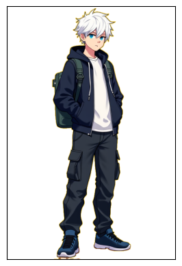
    


    

    


    

    


# Формирование промта для генерации второго персонажа


```python
prompt_character2 = """A full-body character standing in the center of the image, detailed and vibrant, "with no shadows".
A character design for a game, on a very light yellow background.
""" + translate_text_on_eng(prompt_for_generate_image(character2)) + """. 
Art style: anime-style with clean lines, vibrant colors, and attention to small technological details."""

print(prompt_character2)
```

    A full-body character standing in the center of the image, detailed and vibrant, "with no shadows".
    A character design for a game, on a very light yellow background.
    When depicting a character named "Vlad," consider the following features of his appearance:
    The character "Vlad" is aged: 14-16 years old.
    The character "Vlad" is: Male.
    The character "Vlad" has: European appearance.
    The character "Vlad"'s height: Not specified.
    The character "Vlad"'s build (body type): Stocky, especially in the abdomen and shoulder areas.
    The character "Vlad"'s hair: Shaved head.
    The character "Vlad"'s eye color: Not specified.
    The character "Vlad"'s clothing: A gray-green sweater with many dark green stripes, long sleeves, dark gray pants with white stripes on the sides, white sneakers with green inserts.
    Distinguishing features of the character "Vlad": ['Headphones around the neck']. 
    Art style: anime-style with clean lines, vibrant colors, and attention to small technological details.


# Генерация изображений второго персонажа


```python
seed = 145153124382

filenames_character2 = dict()

emotions = ["happy", "shocked", "angry", "scared", "grimaced"]

for emotion in emotions:
    filenames_character2[emotion] = get_image_generated_from_text(prompt_character2 + f"""
    The character is very {emotion}.""", 512, 768, seed)
    img = remove_background(load_image_from_photofield(filenames_character2[emotion]))
    plt.gca().axes.get_xaxis().set_visible(False)
    plt.gca().axes.get_yaxis().set_visible(False)
    plt.imshow(img)
    plt.show()
```


    
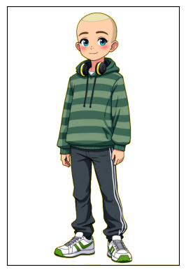
    


    
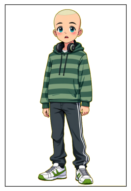
    


    
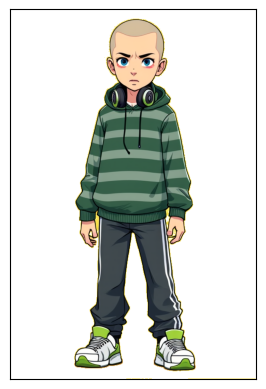
    


    
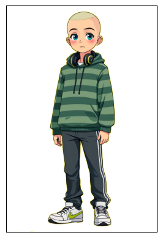
    


    
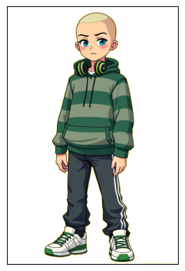
    


# Функция для создания панели с репликами персонажей на фоне

panel_h - высота панели


```python
panel_h = 200

def create_dipanel(image, text_lines, names):
    draw = ImageDraw.Draw(image, 'RGBA')

    draw.rectangle([(0, image.size[1] - panel_h), (image.size[0], image.size[1])], fill=(0, 0, 0, 200))
    
    name_font = ImageFont.truetype("arial.ttf", 28)
    text_font = ImageFont.truetype("arial.ttf", 24)

    y_pos = image.size[1] - panel_h + 5
    for i, (name, text) in enumerate(zip(names, text_lines)):
        draw.text((30, y_pos + 60*i), f"{name}:", font=name_font, fill=(255, 215, 0))
        lines = []
        current_line = []
        for word in text.split():
            test_line = ' '.join(current_line + [word])
            if text_font.getlength(test_line) < image.size[0] - 200:
                current_line.append(word)
            else:
                lines.append(' '.join(current_line))
                current_line = [word]
        lines.append( ' '.join(current_line) )
        for j, line in enumerate(lines):
            draw.text((200, y_pos + 60*i + 30 * j), line, font=text_font, fill=(255, 255, 255))
```

# Создание изображений новеллы


```python
for scenes_chapter in scenes_chapters:
    full_text = read_doc(scenes_chapter)
    
    answer = query_llm(f"""У тебя есть текст с названием главы, описанием сцен, места действия, репликах персонажей.
Тебе нужно превратить данный текст в словарь JSON, дав только ответ и никак не комментируя его. Не добавляй новых деталей.
Словарь JSON должен иметь следующие ключи: ключ "names" содержит строку с названием главы и её номером, ключ "scenes" со списком.
В списке по ключу "scenes" каждый элемент должен быть словарем JSON и описывать одну из сцен в тексте.
Словарь в списке "scenes" должен иметь ключи "background_description" и "miseenscenes".
Ключ "background_description" с описанием места действия и визуальными деталями. В этом описании не должны упоминаться персонажи.
Ключ "miseenscenes" содержит список, каждый элемент из которого является словарем.
Каждый элемент списка по ключу "miseenscenes" должен быть сделан на основе реплики одного из персонажей и содержать поля "pictures1", "pictures2", "dialogue", "names".
В поле "pictures1" должна быть одна из эмоций, наиболее подходящая для персонажа "{character1["name"]}" в процессе данного диалога.
Нужно выбрать только одну из следующих эмоций: "happy", "shocked", "angry", "scared", "grimaced". Других эмоций добавлять нельзя.
В поле "pictures2" должна быть одна из эмоций, наиболее подходящая для персонажа "{character2["name"]}" в процессе данного диалога.
Нужно выбрать только одну из следующих эмоций: "happy", "shocked", "angry", "scared", "grimaced". Других эмоций добавлять нельзя.
В поле "names" должно быть указано имя персонажа для данной реплики.
В поле "dialogue" должен быть указан текст с репликой персонажа.
Текст с описанием главы:

-------
{full_text}""")
    data = json.loads(answer[ answer.index("{") : answer.rindex("}") + 1 ])

    plt.text(0.5, 0.5, data["names"], fontsize=14, ha='center', va='center')
    plt.gca().axes.get_xaxis().set_visible(False)
    plt.gca().axes.get_yaxis().set_visible(False)
    plt.show()
    
    scenes = data["scenes"]
    
    for i in range(len(scenes)):
        background_name = get_image_generated_from_text(
            translate_text_on_eng(scenes[i]["background_description"]) + """
    Art style: doodle-style with clean lines, vibrant colors, and attention to small technological details.""", 1024, 768)
    
        response = requests.get("https://photo.story-tech.ru/api/files/" + background_name.split("_")[1].lstrip("0") + "/original/" + background_name)
        background = Image.open( BytesIO(response.content))
    
        for j in range(len(scenes[i]["miseenscenes"])):
            scene_image = background.copy()
    
            ch1 = remove_background( load_image_from_photofield(filenames_character1[ scenes[i]["miseenscenes"][j]["pictures1"] ]) )
            ch1 = ch1.crop(ch1.getbbox())
            ch1.thumbnail((384, 576), Image.Resampling.LANCZOS)
            scene_image.paste(ch1, (50, scene_image.size[1] - ch1.size[1]), ch1)
    
            ch2 = remove_background( load_image_from_photofield(filenames_character2[ scenes[i]["miseenscenes"][j]["pictures2"] ]) )
            ch2 = ch2.crop(ch2.getbbox())
            ch2.thumbnail((384, 576), Image.Resampling.LANCZOS)
            scene_image.paste(ch2, (scene_image.size[0] - ch2.size[0] - 50, scene_image.size[1] - ch2.size[1]), ch2)
    
            create_dipanel(scene_image, [scenes[i]["miseenscenes"][j]["dialogue"] ], [ scenes[i]["miseenscenes"][j]["names"] ])
            plt.imshow(scene_image)
            plt.gca().axes.get_xaxis().set_visible(False)
            plt.gca().axes.get_yaxis().set_visible(False)
            plt.show()
```


    
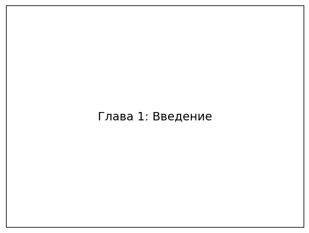
    


    
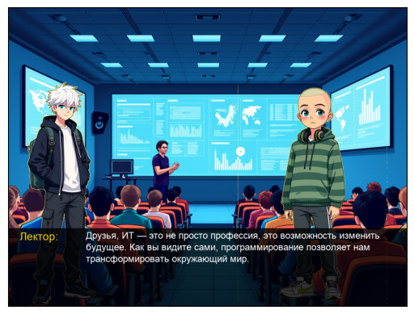
    


    
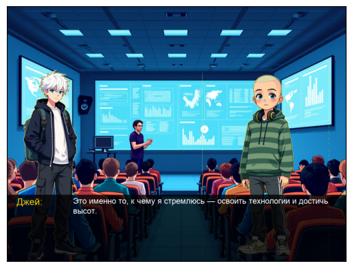
    


    
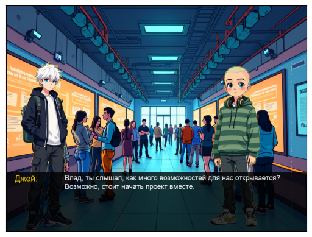
    


    
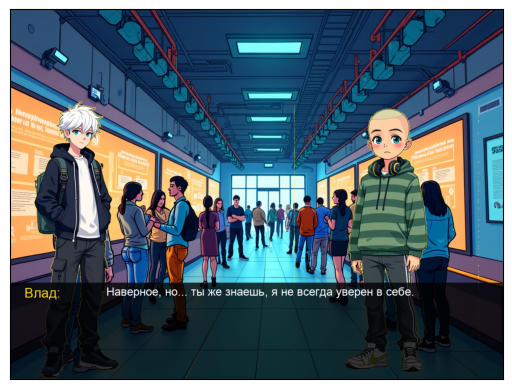
    


    

    


    
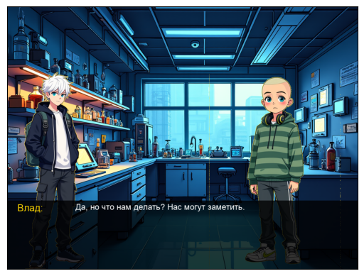
    


    
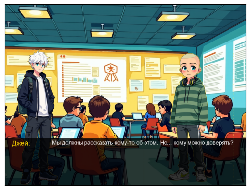
    


    
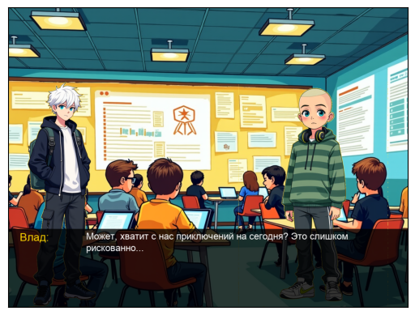
    


    
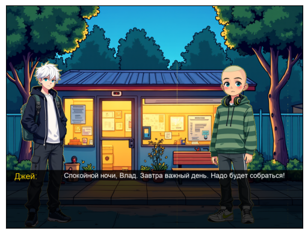
    


    
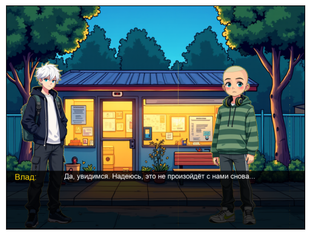
    


    
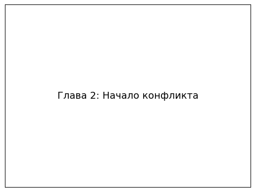
    


    
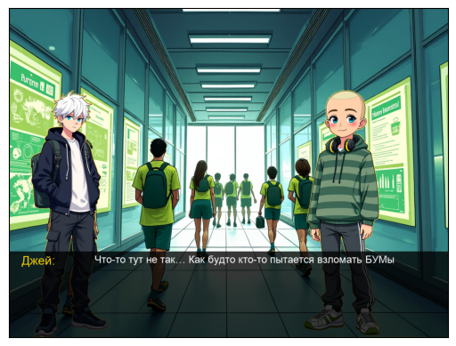
    


    
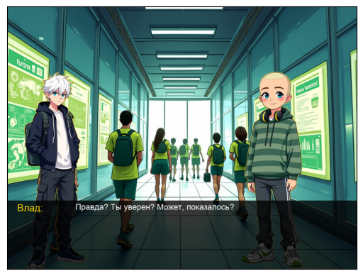
    


    
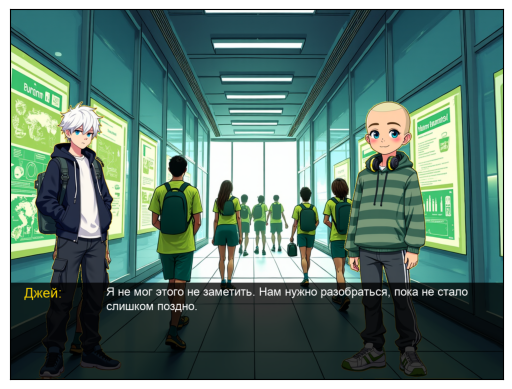
    


    
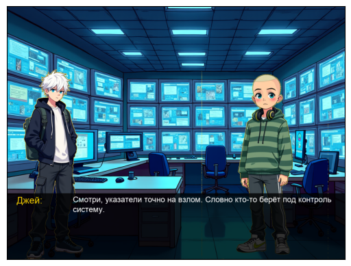
    


    
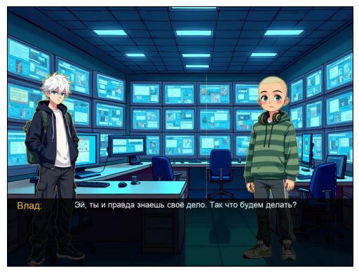
    


    
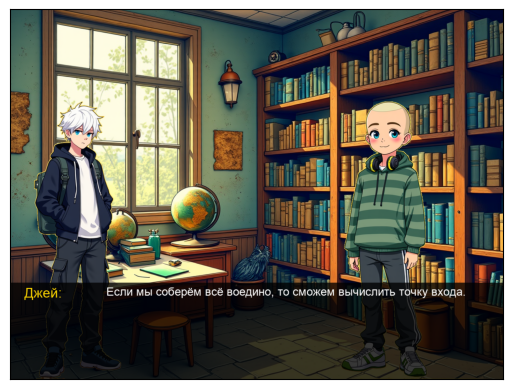
    


    

    


    
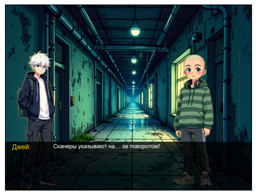
    


    
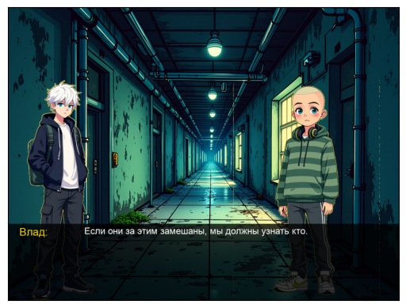
    


    
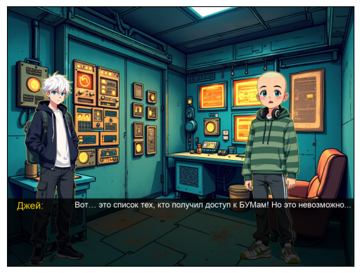
    


    
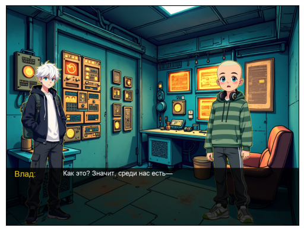
    


    

    


    

    


    
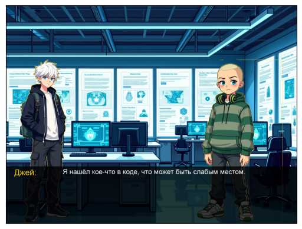
    


    
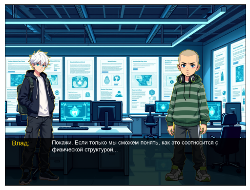
    


    
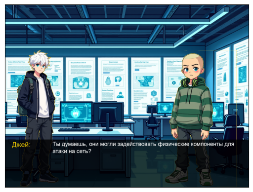
    


    

    


    
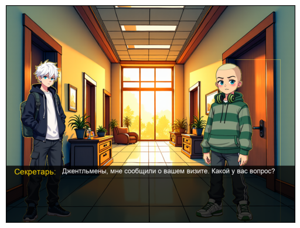
    


    
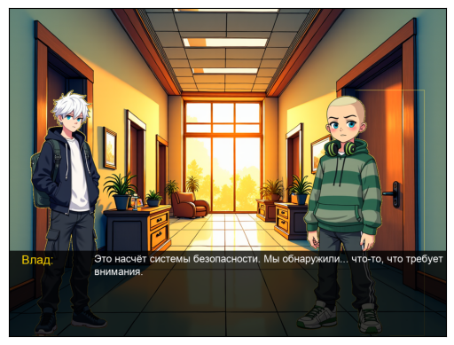
    


    

    


    
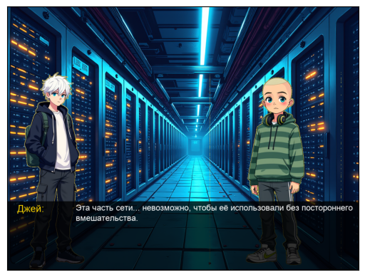
    


    
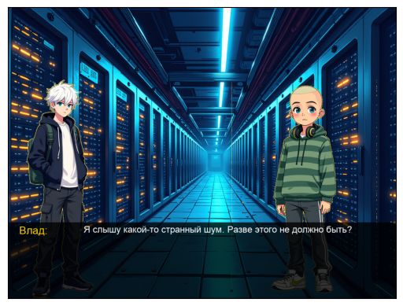
    


    

    


    
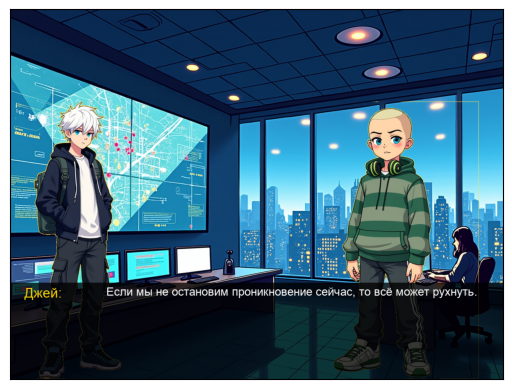
    


    
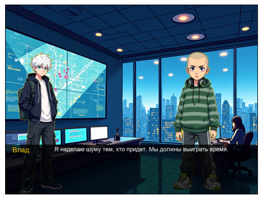
    


    
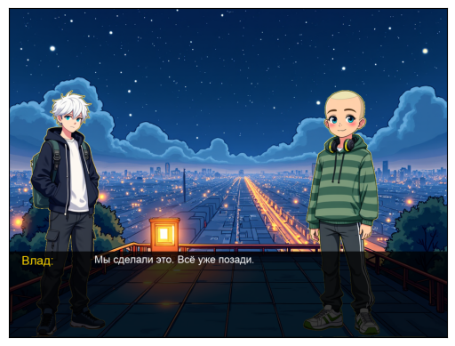
    


    
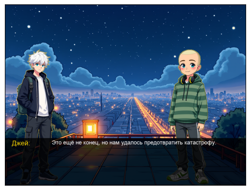
    


    

    


    
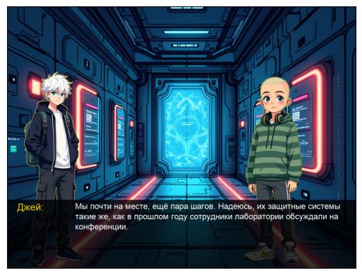
    


    
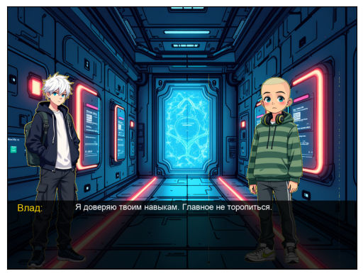
    


    
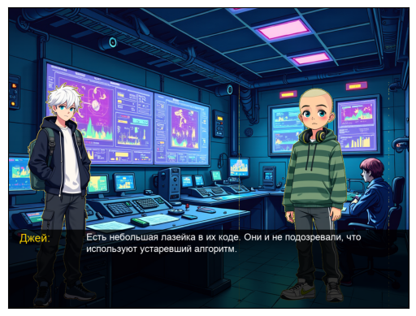
    


    
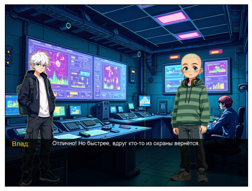
    


    
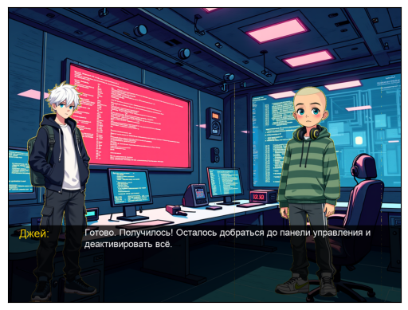
    


    
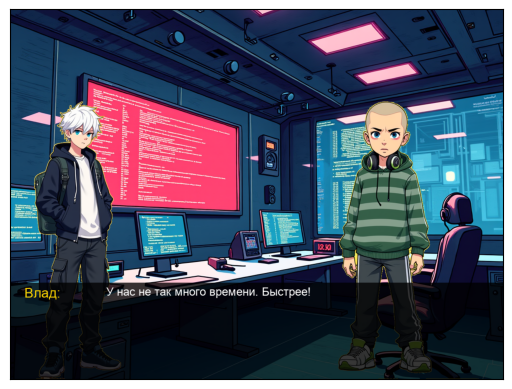
    


    
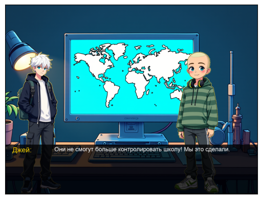
    


    

    


    
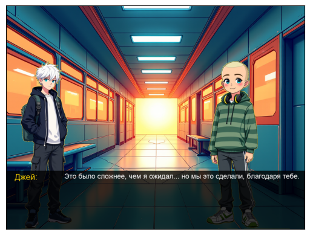
    


    
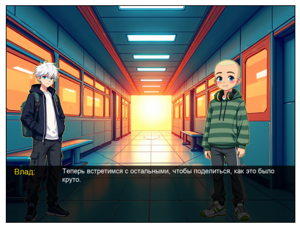
    


    
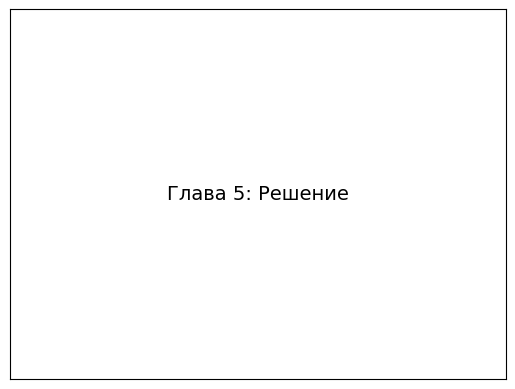
    


    
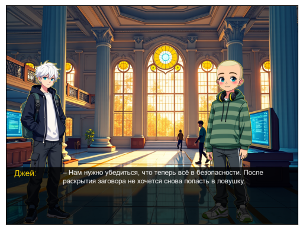
    


    
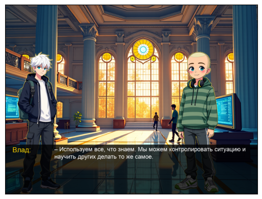
    


    

    


    

    


    

    


    

    


    

    


    

    


    

    


    

    

